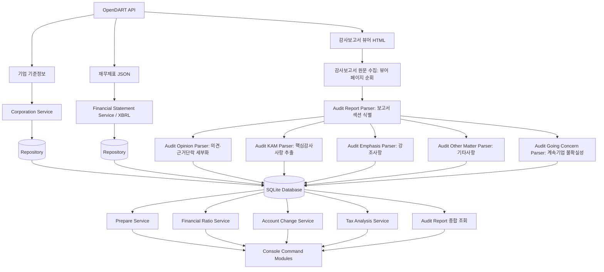

# OpenDART Financial Analyzer (with 생성형 AI)

OpenDART API를 이용하여 기업 기준정보·재무제표·XBRL 법인세 주석·감사보고서를 수집하고 SQLite에 저장한 뒤, 재무비율과 계정별 증감률, 실효세율 등을 분석하는 Python 프로젝트입니다.

단순한 API 호출에 그치지 않고 수집·정규화·저장·조회·분석·콘솔 출력의 책임을 계층별로 분리했습니다. 또한 재무분석에서 발견된 이상수치를 결론이 아닌 추가 검토가 필요한 신호로 보고, 산업 특성·재무제표 주석·감사보고서를 함께 검토할 수 있도록 설계했습니다. 아키텍처 설계와 테스트, 결과 검증은 직접 수행했고 구현에는 생성형 AI를 보조 도구로 활용했습니다.

## 주요 기능

* 기업 고유번호 동기화 및 기업명·종목코드 검색
* 단일회사 전체 재무제표 수집·정규화·저장 (연결·별도, 사업·분기·반기보고서 지원)
* 주요 재무비율(영업이익률·순이익률·ROA·ROE·부채비율·유동비율·EPS) 계산 및 저장·조회
* 주요 계정 증감액·증감률 계산과 이상징후 스크리닝
* 재무제표·재무비율·계정별 증감률 Prepare 및 Batch Prepare
* 실효세율 계산, 법인세 관련 계정 변동 조회
* XBRL 기반 법인세비용 주석 주요 구성항목 조회
* 감사보고서 전문 수집 및 감사의견·KAM·강조사항·기타사항·계속기업 관련 중요한 불확실성 파싱
* 산업별 기업 비교 분석 및 감사보고서를 활용한 이상수치 검토

현재 분석은 재무제표 본문과 법인세 주석 등 정형·반정형 데이터를 기반으로 하며, 수치상의 변동은 결론이 아니라 추가 검토가 필요한 영역을 선별하는 자료로 활용합니다. 실제 원인 분석에는 산업 상황, 거래 구조, 회계정책과 재무제표 주석·감사보고서를 함께 검토해야 한다는 것을 전제로 합니다.

---

## 시스템 구조



### 계층별 역할

| 계층         | 역할                             |
| ---------- | ------------------------------ |
| Client     | OpenDART API 요청과 공통 응답 처리      |
| Service    | 데이터 수집, 동기화, 계산 흐름 관리          |
| Parser     | 외부 API 응답(JSON/XML/XBRL) 및 HTML 뷰어 페이지를 내부 저장 형식으로 변환 |
| Repository | SQLite 저장 및 조회                 |
| Analysis   | 저장된 데이터를 이용한 재무·세무 분석          |
| Audit      | 감사보고서 섹션 식별, 감사의견·근거단락·강조사항·기타사항·계속기업 불확실성·핵심감사사항 파싱 |
| Console    | 사용자 입력, 기능 호출, 결과 출력           |

---

## 프로젝트 구조

```text
opendart-financial-analyzer/
│
analysis/
│   ├── account_change_ratio_service.py
│   ├── financial_ratio_service.py
│   ├── prepare_service.py
│   ├── batch_prepare_service.py
│   ├── effective_tax_rate_service.py
│   ├── tax_account_change_service.py
│   └── income_tax_note_service.py
│
├── audit/
│   ├── audit_report_parser.py         # 조립된 전문에서 감사보고서 섹션 식별
│   ├── audit_opinion_parser.py        # 감사의견 종류·본문 및 근거단락 세부 파싱
│   ├── audit_KAM_parser.py            # 핵심감사사항(KAM) 항목별 추출
│   ├── audit_emphasis_parser.py       # 강조사항 파싱
│   ├── audit_other_matter_parser.py   # 기타사항 파싱
│   ├── audit_going_concern_parser.py  # 계속기업 관련 중요한 불확실성 파싱
│   ├── constants.py
│   ├── models.py
│   └── parser_utils.py
│
├── console/
│   ├── controller.py
│   ├── corporation_selector.py
│   commands/
│   ├── audit_commands.py
│   ├── corporation_commands.py
│   ├── financial_statement_commands.py
│   ├── financial_ratio_commands.py
│   ├── prepare_commands.py
│   ├── batch_prepare_commands.py
│   ├── income_tax_note_commands.py
│   └── tax_commands.py
│
├── dart/
│   ├── client.py
│   ├── corporation_service.py
│   ├── financial_statement_service.py
│   ├── financial_statement_parser.py
│   ├── xbrl_file_service.py
│   ├── audit_report_file_service.py    # 감사보고서 원문 수집
│   └── audit_report_viewer_parser.py   # 감사보고서 원문 수집
│
├── database/
│   ├── connection.py
│   ├── corporation_repository.py
│   ├── financial_ratio_repository.py
│   ├── financial_statement_repository.py
│   └── schema.py
│
├── xbrl/
│   ├── xbrl_instance_parser.py
│   ├── presentation_parser.py
│   ├── xbrl_label_parser.py
│   ├── xbrl_note_table_parser.py
│   └── xbrl_models.py
│
├── data/
│   └── audit_reports/    # 수집한 감사보고서 원문 저장
├── tests/
├── config.py
├── main.py
├── utils.py
└── requirements.txt
```

> 감사보고서 원문 수집 방식은 XML 직접 다운로드에서, DART 감사보고서 뷰어의 HTML·JavaScript 렌더링 구조를 페이지 단위로 순회하며 조각을 모아 전문을 조립하는 방식으로 변경했습니다. 이는 XML 다운로드 방식의 안정성 문제를 개선하기 위한 것입니다.

---

## 설치 및 실행

```bash
git clone https://github.com/sangbongc/opendart-financial-analyzer.git
cd opendart-financial-analyzer
python -m venv .venv && source .venv/bin/activate   # Windows: .venv\Scripts\activate
pip install -r requirements.txt
cp .env.example .env   # DART_API_KEY 입력 (Windows: copy .env.example .env)
python main.py
```

## 기술 스택

Python · OpenDART API · SQLite · Requests · python-dotenv · pytest · wcwidth

## 테스트

```bash
pytest
```

Mock 기반 단위 테스트와 Repository 테스트로, 외부 API를 호출하지 않고도 핵심 로직(파싱·계산·저장·조회)을 검증합니다.

---

## 개발 현황

## 개발 현황

| Phase | 내용 | 상태 |
|---|---|---|
| 1 | 프로젝트 기반 구축(Client, SQLite, Repository) | 완료 |
| 2 | 기업 기준정보 동기화·검색 | 완료 |
| 3 | 재무제표 수집·저장·조회 | 완료 |
| 4 | 주요 재무비율 계산·저장·조회 | 완료 |
| 5 | 계정별 증감액·증감률 및 이상징후 스크리닝 | 완료 |
| 6 | 실효세율·법인세 계정 분석 및 XBRL 법인세 주석 파싱 | 완료 |
| 7 | Prepare·Batch Prepare 및 콘솔 명령 구조 개선 | 완료 |
| 8 | 감사보고서 수집·파싱 및 종합 조회 | 완료 |
| 9 | 산업별 기업 비교 분석 및 데이터 검증 로직 개선 | 완료 |

### 향후 계획

* 회계이익-법인세비용 조정표 등 법인세 주석 분석 확장
* 감사보고서(KAM)와 재무분석 결과 연계
* 산업별 통계 기반 이상징후 탐지
* 기업 간 다년도 추세 분석
* 정정공시 자동 반영
---

## 활용 가능성

기업 재무상태 기초 분석 · 산업별 기업 비교 분석 · 재무비율 및 계정 변동 스크리닝 · 실효세율 및 법인세 주석 분석 · 감사보고서(KAM·강조사항·계속기업 관련 중요 불확실성 등) 조회 · 재무분석과 감사보고서를 연계한 이상수치 검토 · 회계·감사·세무 데이터 분석 포트폴리오

## 주의사항

* 학습 및 포트폴리오 목적으로 개발했으며, 투자 권유·세무 자문·회계감사 의견을 의미하지 않습니다.
* 계정 변동률이 크다는 것이 곧바로 회계 오류나 위험을 뜻하지 않으며, 산업 상황·거래 구조·회계정책·주석을 함께 검토해야 합니다.
* 실효세율·이연법인세 변동은 총액 기준 스크리닝 결과이며, 원인 분석에는 주석 상세 내역이 필요합니다.
* 감사보고서 뷰어 페이지 구조 변경 시 수집 로직이 영향을 받을 수 있습니다.
* 실제 OpenDART API 인증키는 저장소에 포함하지 않습니다.
